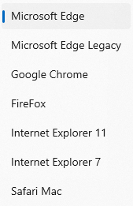
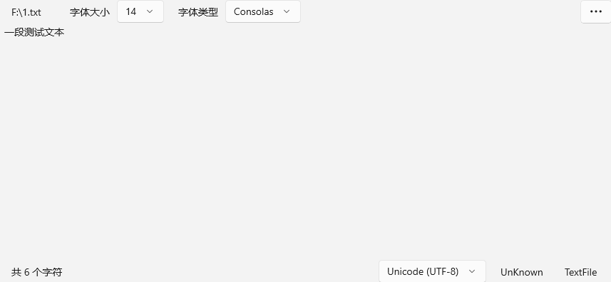

# WinUIEdge

一个简易浏览器，基于WinUI3 和 Edge WebView2

**注意：** 如果想要使用此软件，需要安装 [Microsoft Edge WebView2](https://developer.microsoft.com/zh-cn/microsoft-edge/webview2/) ，因为此软件的核心功能依赖于此。

## 特色功能

### 手动切换浏览器 User-Agent

除了浏览器默认的 User-Agent，还提供包括 Chrome 在内的七种 User-Agent 选择，切换后网页将自动刷新

### 快捷打开Dev Tools 工具

在软件的右下角提供了快捷打开 DevTools 窗口的按钮

### 现代化的 UI 设计风格

软件整体采用 `WinAppSDK` 设计，采用自定义标题栏，外观采用 `Mica` 材质，在设置界面可以自定义外观，包括 `Acrylic`， `Mica Alt`等。

下载、历史记录的弹出窗口使用重绘的窗口代替浏览器自带的窗口，但由于目前其功能不稳定且不完善，将会提供切换的开关

### 本地文件浏览

在显示本地文件时，传统浏览器的呈现方式不是很好，在本软件中，采用 `WinAppSDK` 渲染，并且提供 **字体，字号的更改** ，以及 **切换文件编码格式**。

同时还能显示 `文件行尾序列` ， `文件类型` 等。

## 安装该软件的最低条件

1. 最新版本的 [Microsoft Edge WebView2 Runtime](https://developer.microsoft.com/zh-cn/microsoft-edge/webview2/)
2. 至少 Windows 11 21H2 (Build 22000)，后续将考虑添加 Win10 支持

## 如何从源代码构建

1. [Visual Studio 2022](https://visualstudio.microsoft.com/zh-hans/vs/)
2. 确保安装 `.NET 桌面开发`， `通用 Windows 平台开发` 等组件
3. [.NET Core 8.0](https://dotnet.microsoft.com/zh-cn/download/dotnet/8.0)
4. 一些相关的 `NuGet` 包
