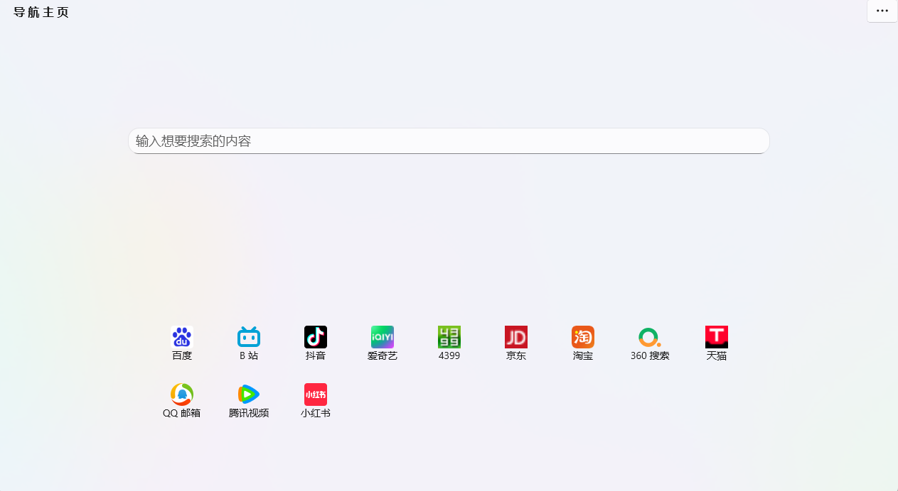
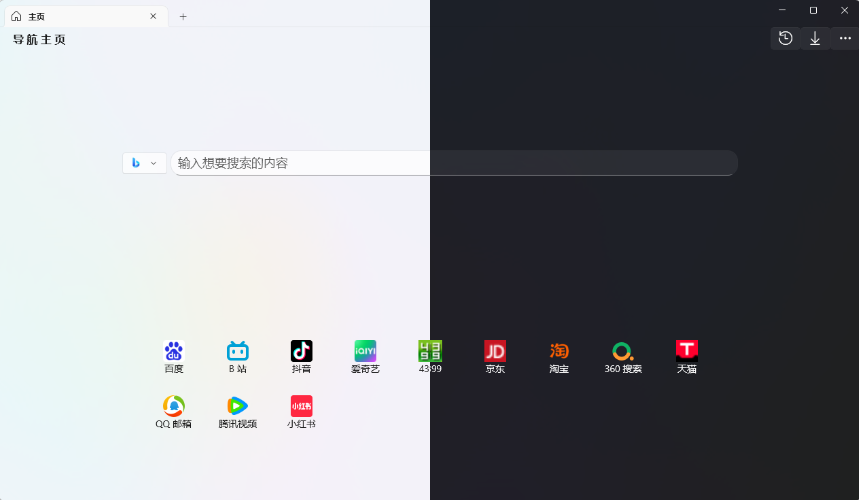
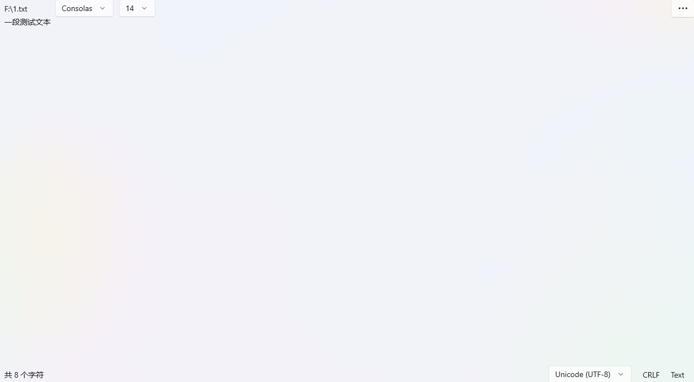
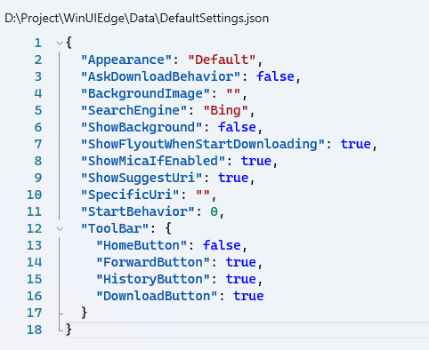
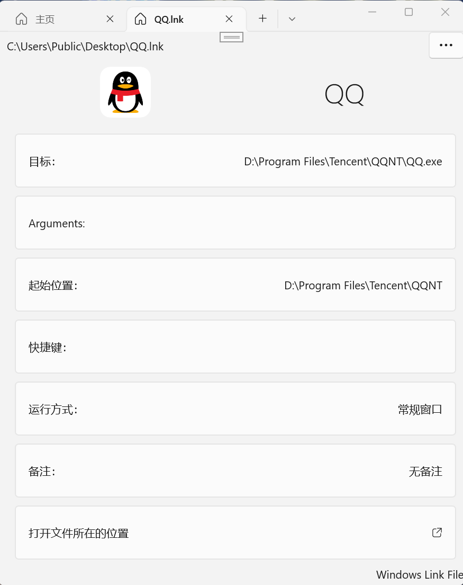
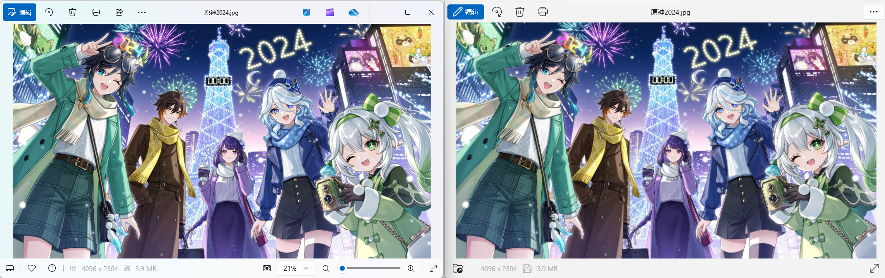
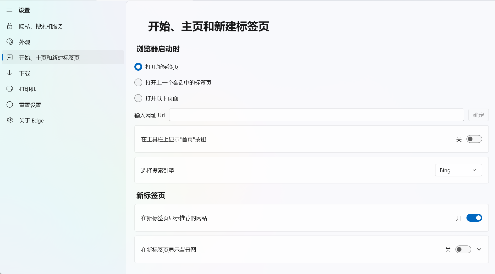

# WinUIEdge

**注意：** 如果想要使用此软件，需要确保电脑已经安装 [Microsoft Edge WebView2](https://developer.microsoft.com/zh-cn/microsoft-edge/webview2/) ，如果系统自带的 Microsoft Edge 没有被暴力卸载，那么 WebView2 大概率也是存在的。

## 特色功能

### 本地控件制作的新版 “主页”

主页的设计整体 **干净清爽**，默认在下方固定一些国内常用的导航网址，既可以单独删除，也可以不显示这些网站。

同时还可以自定义主页的壁纸样式。

### 软件高度自定义

软件支持深浅色的自由切换，默认支持系统原生主题，同时支持多种自定义主题

下载、历史记录的弹出窗口使用重绘的窗口，并不会采用浏览器自带的弹出窗口

### 本地原生支持的文本渲染引擎

传统浏览器对于文本文件的渲染支持的不是很好，本软件的文本控件基于 Scintilla框架，为部分语言启用了语法高亮，
同时还有行号显示，语言识别，编码调整等功能。

对于传统的文本文件：

对于 **Json** 文件：

对于 **Windows lnk** 文件：

后续会添加更多其他形式的特殊文件。

### 重新制作的图片查看界面

左：Windows 11 新版照片查看器

右：本软件的照片查看界面

重新设计的图片查看界面借鉴了 Windows 11 新版的照片查看界面，在功能上更加完善。

### 设置界面提供丰富的自定义选项

在设置界面，可以实现不少对浏览器的自定义控制。

## 使用本软件的最低要求

1. 最新版本的 [Microsoft Edge WebView2 Runtime](https://developer.microsoft.com/zh-cn/microsoft-edge/webview2/)
2. Windows 11 21H2 (Build 22000.0) 或更高版本

## 如何从源代码构建

1. [Visual Studio 2022 Community](https://visualstudio.microsoft.com/zh-hans/vs/)
2. 确保安装 `.NET 桌面开发`， `通用 Windows 平台开发` 等组件
3. [.NET 9.0](https://dotnet.microsoft.com/zh-cn/download/dotnet/9.0)
4. `NuGet` 包
