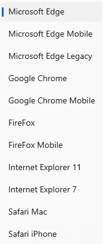
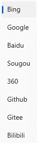

# WinUIEdge

一个简易浏览器，基于WinUI3 和 Edge WebView2

**注意：** 如果想要使用此软件，需要安装 [Microsoft Edge WebView2](https://developer.microsoft.com/zh-cn/microsoft-edge/webview2/) ，因为此软件的核心功能依赖于此。

## 特色功能

### 快速切换浏览器 User-Agent

提供了快速切换的按钮，目前可以提供 11 种 UA 选择，当前网页将在切换后自动刷新

其中 Mobile 指的是 iPhone 平台

### 快捷打开Dev Tools 工具

在软件的右下角提供了快捷打开 DevTools 窗口的按钮

### 搜索栏临时切换搜索引擎

在搜索栏的左侧，提供可以切换搜索引擎的选项，切换后的此次搜索将采用指定的搜索引擎，默认搜索引擎不受影响

### 现代化的 UI 设计风格

软件整体采用 `WinAppSDK` 设计，采用自定义标题栏，外观采用 `Mica` 材质，在设置界面可以自定义外观，包括 `Acrylic`， `Mica Alt`等。

下载、历史记录的弹出窗口使用重绘的窗口，并不会采用浏览器自带的弹出窗口

### 本地文件浏览

在显示本地文件时，传统浏览器的呈现方式不是很好，在本软件中，采用 `WinAppSDK` 渲染，并且提供 **字体，字号的更改** ，以及 **切换文件编码格式**。

同时还能显示 `文件行尾序列` ， `文件类型` 等。

## 安装该软件的最低条件

1. 最新版本的 [Microsoft Edge WebView2 Runtime](https://developer.microsoft.com/zh-cn/microsoft-edge/webview2/)
2. 至少 Windows 11 21H2 (Build 22000)，后续将考虑添加 Win10 支持

## 如何从源代码构建

1. [Visual Studio 2022 Community](https://visualstudio.microsoft.com/zh-hans/vs/)
2. 确保安装 `.NET 桌面开发`， `通用 Windows 平台开发` 等组件
3. [.NET 8.0](https://dotnet.microsoft.com/zh-cn/download/dotnet/8.0)
4. `NuGet` 包
